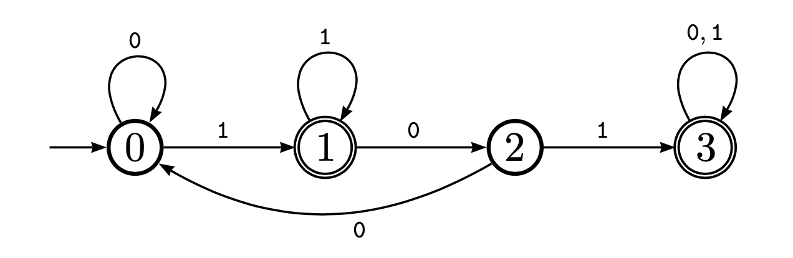

# DFA-using-Java

## Description

This program simulates a DFA using Java. 
The program takes as input a String representation of a DFA, followed by String inputs from the alphabet {0,1}. The program then returns either True if the String belongs to the language of the DFA, or False if it doesn't. The program can be edited to support more alphabets.

## DFA String representation

A string describing a DFA is of the form P#S, where P is a prefix representing the transition functions and S is a suffix representing the set F of accept states.

P is a semicolon-separated sequence of triples; each triple is a comma-separated sequence of states. A triple i,j,k means that δ(i,0) = j and δ(i,1) = k.

S is a comma-separated sequence of states (the accept states).

For example, the DFA for which the state diagram appears below may have the following string representation:
0,0,1;1,2,1;2,0,3;3,3,3#1,3
This representation translates to: 
- First triple: at state 0, input 0 goes to state 0, and input 1 goes to state 1.
- Seconf triple: at state 1, input 0 goes to state 2, and input 1 goes to state 1.
and so on.

